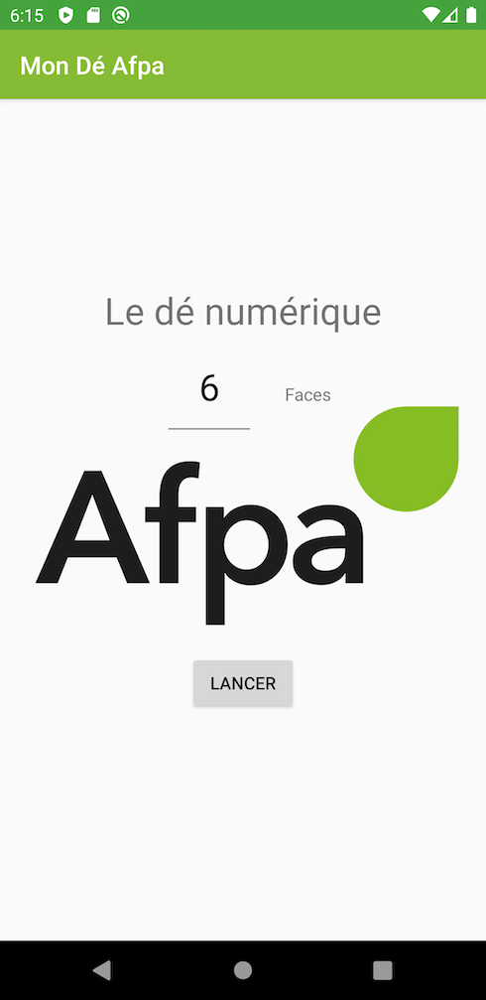
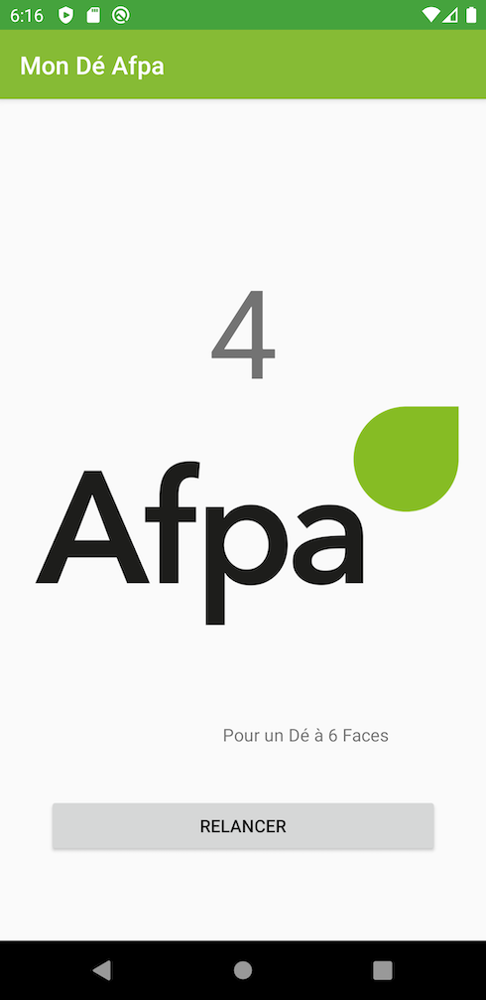

# MonDeAfpa

## Exercice d'application des bases d'android

Une simple application de lancé de dé où l'on peut choisir le nombre de faces du dé

Le projet est prévu pour tourner sur une tablette Archos 7.0